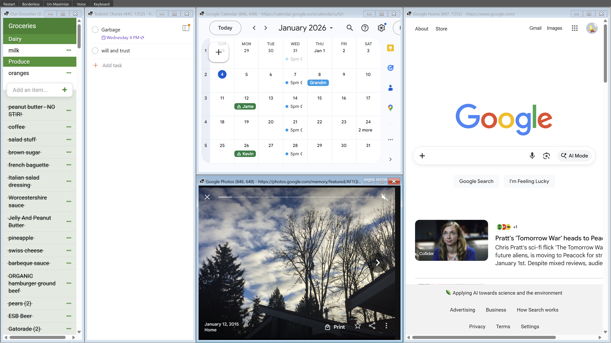
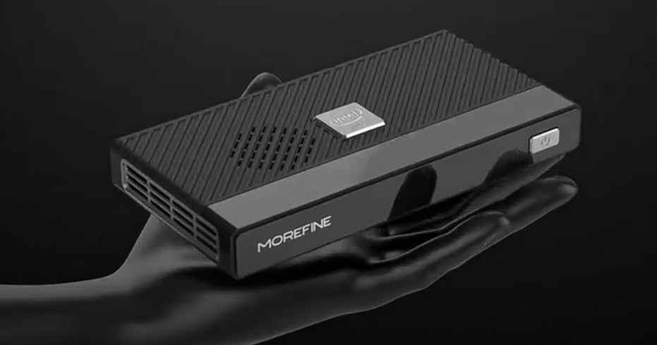
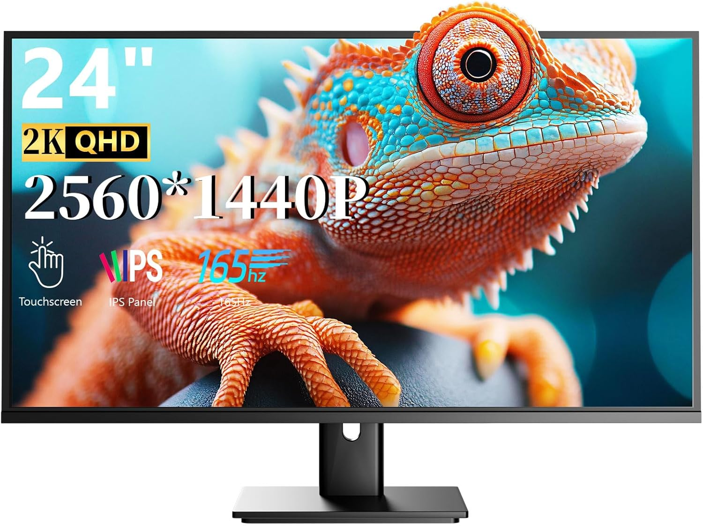

#  Home Base

 A C# WinForms MDI dashboard application that hosts multiple WebView2 browser panels in a configurable layout with persistent session management, voice input, and auto-discovery of panel-specific scripts and styles.

<br/><br/><br/>


## Features

✅ **True MDI** - Built-in drag, resize, minimize, maximize, and close functionality for all panels  
✅ **Persistent WebView2 Environment** - Logins and sessions preserved across Restart refreshes  
✅ **Popup Auth Handling** - Authentication popups open within the same WebView2 to preserve session cookies  
✅ **YAML-Based Layout** - Flexible panel configuration using `hgroup` (horizontal flex) and `vgroup` (vertical equal division)  
✅ **Web Speech API Voice Input** - Voice-to-text powered by browser's native SpeechRecognition API  
✅ **Auto-Discovery Scripts/Styles** - Panel-specific JS and CSS files loaded automatically based on panel title (spaces → minus sign)  
✅ **Panel Activation Awareness** - Scripts can check if a panel is active to prevent interference from backgrounded panels  
✅ **URL Tracking & Dimensions** - Panel titles automatically update with current page URL and inner client dimensions  
✅ **Configurable Window Position** - `start-x` and `start-y` to position the app anywhere on multi-monitor setups  
✅ **Toolbar Buttons** - Restart, Borderless, Un-Maximize, Voice, Keyboard (OSK) buttons with auto-sizing  

## Requirements

- Windows 10/11
- .NET 10.0 Preview (or .NET 8+)
- Microsoft Edge WebView2 Runtime

## Project Structure

```
HomeBase/
├── HomeBase.Forms/
│   ├── Program.cs                 # Main application with MDI container, layout engine, voice button, toolbar
│   └── HomeBase.Forms.csproj
├── config.yml                     # Layout, panel configuration, and window positioning
├── scripts/
│   ├── voice-input.js            # Web Speech API wrapper (auto-injected to all panels)
│   ├── our-groceries.js          # Auto-discovered for "Our Groceries" panel
│   └── [panel-title].js          # Auto-discovered based on panel title (spaces → minus)
├── !runme.cmd                     # Launch script with dotnet watch
└── README.md
```

## Configuration

Edit `config.yml` to define your dashboard layout:

```yaml
start-x: 4500           # Window left edge position
start-y: 300            # Window top edge position
width: 2560             # Dashboard outer width
height: 1440            # Dashboard outer height
vgroup:
  - title: Our Groceries
    url: https://www.example.com/groceries
    width: 330          # Optional: fixed inner client width in pixels
  
  - hgroup:             # Horizontal flex row
    - title: Google Calendar
      url: https://calendar.google.com
    
    - title: Google Photos
      url: https://photos.google.com
    
    - title: Google Tasks
      url: https://tasks.google.com
```

### Layout Types

- **`hgroup`** - Horizontal flex layout (children share width; panels with `width` property get fixed pixels, remainder flex equally)
- **`vgroup`** - Vertical equal division (children split remaining height equally)
- **`panel` (implicit)** - Single WebView2 panel when neither group type is specified

### Panel Properties

- `title` - Display name shown in the MDI child window title bar (also used for auto-discovery)
- `url` - Initial URL to navigate to
- `width` - Optional: fixed inner client width in pixels (for `hgroup` children; omit for flex width)

### Window Positioning

- `start-x` - Left edge position in screen coordinates (useful for multi-monitor setups)
- `start-y` - Top edge position in screen coordinates

## Auto-Discovery of Scripts and Styles

The application automatically discovers and injects JavaScript and CSS files based on panel titles:

**Panel title:** `Our Groceries`  
**Auto-discovered files:**
- `scripts/our-groceries.js` (if present)
- `scripts/our-groceries.css` (if present)

Conversion rule: Replace spaces with hyphens, convert to lowercase.

### Voice Input in Panel Scripts

All panels have access to the `startVoiceInput()` function. Example usage:

```javascript
// scripts/our-groceries.js
setInterval(() => {
  const inputField = document.querySelector('input[placeholder="Add item"]');
  if (inputField && document.hidden === false) {
    inputField.addEventListener('focus', () => {
      window.startVoiceInput();
    });
  }
}, 1000);
```

The voice input respects panel activation: only the active (focused) panel will process voice input, preventing multiple panels from listening simultaneously.

## Usage

### Run the Application

```cmd
!runme.cmd
```

Or manually:

```cmd
dotnet watch run --no-hot-reload --project HomeBase.Forms/HomeBase.Forms.csproj
```

### Keyboard Shortcuts & Toolbar Buttons

| Action | Button | Shortcut | Effect |
|--------|--------|----------|--------|
| **Restart** | Toolbar | F5 | Recreates all panels, preserves logins |
| **Borderless** | Toolbar | F6 | Toggles window border (maximize space) |
| **Un-Maximize** | Toolbar | — | Restores any maximized child to normal size |
| **Voice** | Toolbar | Ctrl+Shift+V | Starts Web Speech API listening on active panel |
| **Keyboard** | Toolbar | — | Launches Windows On-Screen Keyboard (osk.exe) |

### Mouse Actions

- **Drag title bar** - Move MDI child window
- **Drag edges/corners** - Resize MDI child window
- **Double-click title** - Copy current URL to clipboard
- **Minimize/Maximize/Close** - Standard MDI window buttons

## Technical Details

### Persistent WebView2 Sessions

The application uses a shared `CoreWebView2Environment` instance that persists across Restart refreshes. The user data folder is stored at `%LOCALAPPDATA%\HomeBase\WebView2Data\`, ensuring:

- Login sessions remain active between refreshes
- Cookies and cached data are preserved
- Authentication state is maintained
- Migration from old `.WebView2Data/` location handled on first startup

### Popup Authentication

Authentication flows that open popup windows (e.g., OAuth) are handled via the `NewWindowRequested` event, which redirects the popup URL to the same WebView2 instance. This prevents session loss.

### Web Speech API Voice Input

`voice-input.js` is automatically injected into all panels:

```javascript
// Always available in all panels
window.startVoiceInput();     // Start listening
window.stopVoiceInput();      // Stop listening
window.__isPanelActive        // boolean: true if panel is focused, false if backgrounded
```

**Guard against inactive panels:**

```javascript
// Your script automatically checks activation state
if (window.__isPanelActive !== true) {
  return;  // Skip voice if this panel isn't active
}
```

### Panel Title Format

Titles show current URL and inner client dimensions:

```
Our Groceries — www.example.com/groceries (330 × 640)
```

### Layout Calculation & Sizing

The layout engine:

1. Parses `config.yml` to extract window position, outer dimensions, and layout structure
2. Measures the MDI container's `ClientSize` (accounting for title bar and borders)
3. Recursively computes panel rectangles:
   - `hgroup`: Panels with `width` property get fixed pixels; remainder split flex panels equally
   - `vgroup`: All children split height equally
4. Creates MDI child forms positioned at calculated coordinates
5. Validates that all panels fit without scrollbars (rule: Width OK, Height OK)

**Example calculation:**
- Container: 2560 × 1440
- Config width: 2560, height: 1440 → outer bounds
- Panel chrome overhead: ~22 pixels per panel side
- First panel: `width: 330` → 330px inner client width, ~374px outer
- Remaining panels: flex to fill remaining horizontal space

### Hot-Reload Disabled

WinForms metadata handlers are incompatible with .NET hot-reload, so the application runs with `--no-hot-reload`.

### File Watchers

The application automatically reloads when these files change:

- `config.yml` - Triggers full layout recalculation and panel recreation
- `scripts/**/*.js` - Panel-specific scripts re-injected (or auto-discovered for new files)
- `scripts/**/*.css` - Panel styles refreshed

### Dependencies

- **Microsoft.Web.WebView2.WinForms** - WebView2 control and environment management
- **YamlDotNet** - YAML configuration parsing

## License

MIT

## Anticipated Hardware Pairing

### 12gen Alder Lake N200 based mini PC = $250
- 16GB RAM
- supposed to handle 10-15 webview panels easily

[](https://www.amazon.com/gp/product/B0DHXWWWVY)

### 24 inch, 2560x1440, 10-Point Capacitive Touch Screen = $210
[](https://www.amazon.com/gp/product/B0FNM2DSJR)
