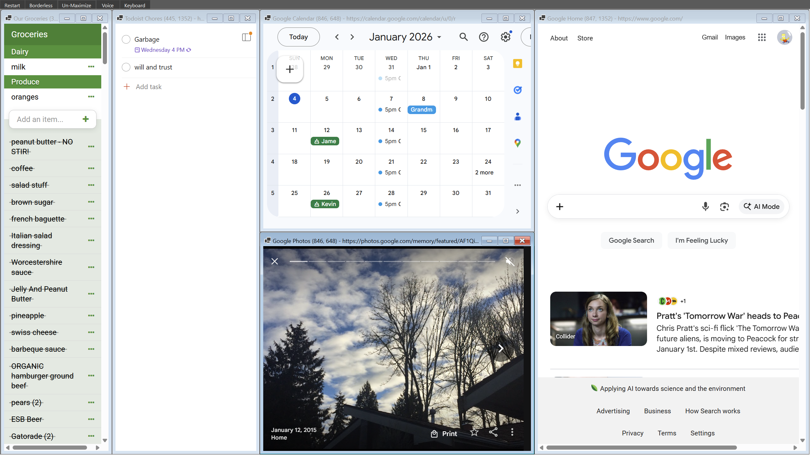

#  Home Base

 A C# WinForms MDI dashboard application that hosts multiple WebView2 browser panels in a configurable layout with persistent session management, voice input, and <mark>injected scripts and styles</mark> to customize existing 3rd party web pages like todoist, google cal, etc.

 To be used like [Skylight](https://myskylight.com), [DAKBoard](https://dakboard.com/), [MagicMirror<sup>2</sup>](https://magicmirror.builders/), [MangoDisplay](https://mangodisplay.com/), etc



## Features

✅ **Good ol' MDI =)** - quick min/max any panel for more space<br/>
✅ **[YAML-Based Layout](#configuration)** - Easy and flexible panel configuration strategy for both fixed and dynamic sized panel bundles<br/>
✅ **[Injected JS/CSS](#auto-discovery-of-scripts-and-styles)** - Override everything we want! remove unecessary "chrome" to shape most minimal UI necessary for each task.<br/>
✅ **[Toolbar Buttons](#keyboard-shortcuts--toolbar-buttons)** - Restart, Borderless, Un-Maximize, Voice, Keyboard (OSK) and Exit<br/>
✅ **[Voice-to-text input](#voice-input-in-panel-scripts)** - Can be automatically activated upon panel focus<br/>
✅ **[Auto restart on config change](#file-watchers)** - Share folder over your LAN, edit config.yml remotely, saving triggers auto refresh for instant results<br/>

## Requirements

- Windows with .Net 8+ sdk loaded

## Usage

### Run the Application

```cmd
!runme.cmd
```

### Keyboard Shortcuts & Toolbar Buttons

| Action | Button | Shortcut | Effect |
|--------|--------|----------|--------|
| **Restart** | Toolbar | F5 | Recreates all panels, preserves logins |
| **Borderless** | Toolbar | F6 | Toggles window border (maximize space) |
| **Un-Maximize** | Toolbar | — | Restores any maximized child to normal size |
| **Voice** | Toolbar | Ctrl+Shift+V | Starts Web Speech API listening on active panel |
| **Keyboard** | Toolbar | — | Launches Windows On-Screen Keyboard (osk.exe) |

### Mouse/Touch Actions

- **Double-click title** - Copy current URL to clipboard

## Configuration

Edit `config.yml` to define your dashboard layout:

```yaml

# start-x: 4500           # Window left edge position
# start-y: 300            # Window top edge position

width: 2560             # Dashboard outer width
height: 1440            # Dashboard outer height

vgroup:
  - title: Our Groceries
    url: https://www.example.com/groceries
    width: 330          # Optional: fixed inner client width in pixels
  
  - hgroup:             # Horizontal flex row
    - title: Google Calendar
      url: https://calendar.google.com
    
    - title: Google Photos
      url: https://photos.google.com
    
    - title: Google Tasks
      url: https://tasks.google.com
```

### Layout Types

- **`hgroup`** - Horizontal flex layout (children share width; panels with `width` property get fixed pixels, remainder flex equally)
- **`vgroup`** - Vertical equal division (children split remaining height equally)
- **`panel` (implicit)** - Single WebView2 panel when neither group type is specified

### Panel Properties

- `title` - Display name shown in the MDI child window title bar (also used for auto-discovery)
- `url` - Initial URL to navigate to
- `width` - Optional: fixed inner client width in pixels (for `hgroup` children; omit for flex width)

### Window Positioning

- `start-x` - Left edge position in screen coordinates (useful for multi-monitor setups)
- `start-y` - Top edge position in screen coordinates

### Layout Calculation & Sizing

The layout engine:

1. Parses `config.yml` to extract window position, outer dimensions, and layout structure
2. Measures the MDI container's `ClientSize` (accounting for title bar and borders)
3. Recursively computes panel rectangles:
   - `hgroup`: Panels with `width` property get fixed pixels; remainder split flex panels equally
   - `vgroup`: All children split height equally
4. Creates MDI child forms positioned at calculated coordinates
5. Validates that all panels fit without scrollbars (rule: Width OK, Height OK)

**Example calculation:**
- Container: 2560 × 1440
- Config width: 2560, height: 1440 → outer bounds
- Panel chrome overhead: ~22 pixels per panel side
- First panel: `width: 330` → 330px inner client width, ~374px outer
- Remaining panels: flex to fill remaining horizontal space


## Project Folder Structure

```
HomeBase/
├── HomeBase.Forms/
│   ├── Program.cs                # Main application with MDI container, layout engine, voice button, toolbar
│   └── HomeBase.Forms.csproj
├── config.yml                    # Layout, panel configuration, and window positioning
├── scripts/                      # and styles
│   ├── voice-input.js            # Web Speech API wrapper (auto-injected to all panels)
│   ├── our-groceries.js          # matched to config.yml panel title
│   ├── our-groceries.css         # ditto
└── !runme.cmd                    # Launch script with dotnet watch
```

### Auto-Discovery of Scripts and Styles

The application automatically discovers and injects JavaScript and CSS files based on panel titles:
(matches by replacing spaces with hyphens and converting to all lowercase)

**Example panel title:** `Our Groceries`  
**Auto-discovered files:**
- `scripts/our-groceries.js` (if present)
- `scripts/our-groceries.css` (if present)

### Voice Input in Panel Scripts

All panels have access to the `startVoiceInput()` and `stopVoiceInput()` function. Example usage:

```javascript
// scripts/our-groceries.js
setInterval(() => {
  const inputField = document.querySelector('input[placeholder="Add item"]');
  if (inputField && document.hidden === false) {
    inputField.addEventListener('focus', () => {
      window.startVoiceInput();
    });
  }
}, 1000);
```

Only the active (focused) panel receives the current voice input. This seemed the best intuitive approach to directing where voice typing happens.

### Panel Title Format

Titles show current URL and inner client dimensions:

```
Our Groceries — www.example.com/groceries (330 × 640)
```

### Hot-Reload Disabled

WinForms metadata handlers are incompatible with .NET hot-reload, so the application runs with `--no-hot-reload`.

### File Watchers

The application automatically reloads when these files change:

- `config.yml` - Triggers full layout recalculation and panel recreation
- `scripts/**/*.js` - Panel-specific scripts re-injected (or auto-discovered for new files)
- `scripts/**/*.css` - Panel styles refreshed

Meant to facilitate convenient deployment of updates from a dev PC to the running panel PC over fileshare.

### Dependencies

- **Microsoft.Web.WebView2.WinForms** - WebView2 control
- **YamlDotNet** - YAML configuration parsing

## License

MIT

## Hardware Ideas

### Core i3-1220P mini PC = ~$400
- 16GB RAM upgradeable to 64GB - supposed to handle 10-15 webview panels easily
- 2 performance + 8 efficiency cores yet only ~10–25W TDP typical use is nicely low end for always-on appliance

[](https://www.amazon.com/gp/product/B0F53QD7S5)


### 27 inch, 2560 x 1440, 10-point capacitive touch screens 
- 2560 x 1440 is same as Skylight Max
- 27" probably the sweet spot for not to small to see, not too big for touch input, and pricing (32" tier closer to $500)

#### Pisichen $300 (100Hz, speakers)
- definitely in budget panel lottery tier! <mark>be ready to test and reorder</mark>

[](https://www.amazon.com/dp/B0G5PP1PMV)

### Counter level stand

#### Wearson WS-03A2 - $25
- 5 x 5" mini pcs should fit in the triangle formed by back side of monitor and lower side of monitor stand to give center of gravity... mount to the arm with [heavy duty "nano" tape](https://www.amazon.com/dp/B07YB1ZXG6)
- rest the monitor directly on the countertop for stability

[](https://www.amazon.com/gp/product/B0CHRX2VYF)
