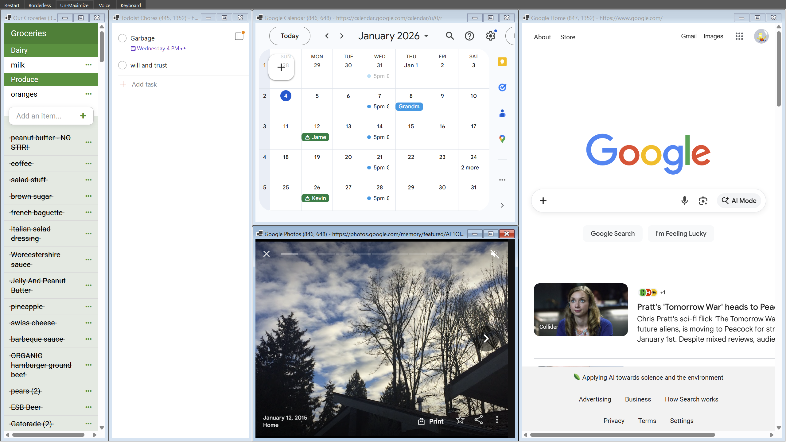

#  Home Base

 A C# WinForms MDI dashboard application that hosts multiple WebView2 browser panels in a configurable layout with persistent session management, voice input, and <mark>injected scripts and styles</mark> to customize existing 3rd party web pages like todoist, google cal, etc.

 To be used like [Skylight](https://myskylight.com), [DAKBoard](https://dakboard.com/), [MagicMirror<sup>2</sup>](https://magicmirror.builders/), [MangoDisplay](https://mangodisplay.com/), etc



## Features

✅ **Good ol' MDI =)** - quick min/max any panel for more space<br/>
✅ **[YAML-Based Layout](#configuration)** - Easy and flexible panel configuration strategy for both fixed and dynamic sized panel bundles<br/>
✅ **[Injected JS/CSS](#auto-discovery-of-scripts-and-styles)** - Override everything we want! remove unecessary "chrome" to shape most minimal UI necessary for each task<br/>
✅ **[Toolbar Buttons](#keyboard-shortcuts--toolbar-buttons)** - Restart, Borderless, Un-Maximize, Voice, Keyboard (OSK) and Exit<br/>
✅ **[Voice-to-text input](#voice-input-in-panel-scripts)** - Can be automatically activated upon panel focus<br/>
✅ **[Auto restart on config change](#run-the-application)** - Share folder over your LAN, edit config.yml remotely, saving triggers auto refresh for instant results<br/>

## Requirements

- Windows =)
- [.Net sdk](https://dotnet.microsoft.com/en-us/download) installed

## Usage

### Run the Application

Just clone project to a folder and launch [`!runme.cmd`](!runme.cmd).<br/>
<br/>
This script will automatically restart the app whenever key files change so we can rapidly iterate UI changes.<br/>
Tip - share and edit from another PC with full desktop conveniences.

### Keyboard Shortcuts & Toolbar Buttons

| Action | Button | Shortcut | Effect |
|--------|--------|----------|--------|
| **Restart** | Toolbar | F5 | Recreates all panels, preserves logins |
| **Borderless** | Toolbar | F6 | Toggles window border (maximize space) |
| **Un-Maximize** | Toolbar | — | Restores any maximized child to normal size |
| **Voice** | Toolbar | Ctrl+Shift+V | Starts Web Speech API listening on active panel |
| **Keyboard** | Toolbar | — | Launches Windows On-Screen Keyboard (osk.exe) |

### Mouse/Touch Actions

- **Double-click title** - Copy current URL to clipboard

## Configuration

Edit `config.yml` to define your preferred custom dashboard layout.<br/>
<br/>
Example:
```yaml

# start-x: 4500           # Window left edge position
# start-y: 300            # Window top edge position

width: 2560             # Dashboard outer width
height: 1440            # Dashboard outer height

vgroup:
  - title: Our Groceries
    url: https://www.example.com/groceries
    width: 330          # Optional: fixed inner client width in pixels
  
  - hgroup:             # Horizontal flex row
    - title: Google Calendar
      url: https://calendar.google.com
    
    - title: Google Photos
      url: https://photos.google.com
    
    - title: Google Tasks
      url: https://tasks.google.com
```

### Layout Types

- **`hgroup`** - Horizontal flex layout (children share width; panels with `width` property get fixed pixels, remainder flex equally)
- **`vgroup`** - Vertical equal division (children split remaining height equally)
- **`panel` (implicit)** - Single WebView2 panel when neither group type is specified

### Panel Properties

- `title` - Display name shown in the MDI child window title bar (also used for auto-discovery)
- `url` - Initial URL to navigate to
- `width` - Optional: fixed inner client width in pixels (for `hgroup` children; omit for flex width)

### Window Positioning

- `start-x` - Left edge position in screen coordinates (useful for multi-monitor setups)
- `start-y` - Top edge position in screen coordinates

### Layout Calculation & Sizing

The layout algorithm:

1. Parses `config.yml` to extract window position, outer dimensions, and layout structure
2. Measures the MDI container's `ClientSize` (accounting for title bar and borders)
3. Recursively computes panel rectangles:
   - `hgroup`: Panels with `width` property get fixed pixels; remainder split flex panels equally
   - `vgroup`: All children split height equally
4. Creates MDI child forms at calc'ed coordinates, all nestled together without scrollbars

**Example calculation:**
- Container: 2560 × 1440
- Config width: 2560, height: 1440 → outer bounds
- Panel chrome overhead: ~22 pixels per panel side
- First panel: `width: 330` → 330px inner client width, ~374px outer
- Remaining panels: flex to fill remaining horizontal space


## Project Folder Structure

```
HomeBase/
├── HomeBase.Forms/
│   ├── Program.cs                # Main application with MDI container, layout engine, voice button, toolbar
│   └── HomeBase.Forms.csproj
├── config.yml                    # Layout, panel configuration, and window positioning
├── scripts/                      # and styles
│   ├── voice-input.js            # Web Speech API wrapper (auto-injected to all panels)
│   ├── our-groceries.js          # matched to config.yml panel title
│   ├── our-groceries.css         # ditto
└── !runme.cmd                    # Launch script with dotnet watch
```

### Auto-Discovery of Scripts and Styles

The application automatically discovers and injects JavaScript and CSS files based on panel titles:
(matches by replacing spaces with hyphens and converting to all lowercase)

**Example panel title:** `Our Groceries`  
**Auto-discovered files:**
- `scripts/our-groceries.js` (if present)
- `scripts/our-groceries.css` (if present)

### Voice Input in Panel Scripts

All panels have access to the `startVoiceInput()` and `stopVoiceInput()` function. Example usage:

```javascript
// scripts/our-groceries.js
setInterval(() => {
  const inputField = document.querySelector('input[placeholder="Add item"]');
  if (inputField && document.hidden === false) {
    inputField.addEventListener('focus', () => {
      window.startVoiceInput();
    });
  }
}, 1000);
```

Only the active (focused) panel receives the current voice input. This seemed the best intuitive approach to directing where voice typing happens.

### Panel Title Format

Titles show current URL and inner client dimensions:

```
Our Groceries — www.example.com/groceries (330 × 640)
```

## License

MIT

## Hardware Ideas

### Beelink EQI12 - Core i3-1220P (12th gen Alder Lake-P), 16GB RAM (DDR4 @ 3200 MHz), 500GB SSD = ~$400
- AI says this can readily handle 10-15 msedge webview panels
- 2P + 8E cores, ~10–25W TDP typical is good for an always-on appliance
- 64GB max ram
- Intel UHD iGPU - 4k2k@60hz max HDMI (2.1) / 8k2k@60hz max DP (1.4a)
  - this iGPU shares system ram and apparently running dual channel makes a big performance difference

[](https://www.amazon.com/gp/product/B0F53QD7S5)


### Pisichen 27 inch, 2560 x 1440, 10-point capacitive touch screen, 100Hz, speakers = $250
- 27 inch, 2560 x 1440 is exact same size as Skylight Max and could be the sweet spot for not-too-small-to-see / not-too-big-for-touch for good  prices (the 32 inch tier jumps to $500)
- 24" model worth considering = ~$200
- make sure you measure your counterspace and see what will actually fit. a 27 inch monitor (24 wide x 14 high x 1 deep) sitting right on counter level takes up a lot of space.
- Pisichen is definitely a budget tier panel vendor - <mark>be ready to test for dead pixels and exchange</mark>

[](https://www.amazon.com/dp/B0G5PP1PMV)

### Wearson WS-03A2 - Counter level monitor stand - $30
- 5 x 5" mini pcs should fit in the triangle formed by back side of monitor and lower side of monitor stand to give center of gravity... mount to the arm with [heavy duty "nano" tape](https://www.amazon.com/dp/B07YB1ZXG6)
- rest the monitor directly on the countertop for stability

[](https://www.amazon.com/gp/product/B0CHRX2VYF)

## Best of breed 3rd Party Web Apps

### Photo Slideshow
- I already scripted auto-cycling through Google Photo's "Memories" feature which provides slick collections even with music. These are really quite good and we get 20 new ones a day.
  - The cool part is the web panel completely bypasses Google's yanking of it's photo API as of March 2025. Many other [dedicated photo frames are instantly bricked](https://tech.yahoo.com/cameras/articles/google-photos-losing-feature-long-182231484.html). But there is literally no way Google could ever bork this approach because it simply uses the google photos UI directly.

### Groceries
- I like [OurGroceries](https://www.ourgroceries.com/) - 100% free. easily shared. both web and mobile apps. brings good behavior like saving multiple lists, checking things off, automatic grocery store sections/categories, etc

### Todo Lists / Reminders
- [TodoIst](https://www.todoist.com/) - pretty much the gold standard, except...
- [FamilyWall](https://www.FamilyWall.com) - TodoIst doesn't do *shared* reminders really, it forces somebody to take each task (for a good reason)... FamilyWall (free tier) does allow for truly shared reminder task (main example: weekly "Take out the garbage") and has android app that pops notifications which is a key part of this working out in practice
  
### Calendar!
- this is definitely where sharing gets thick in a hurry =)
- suggestion: use a dedicated reminder app above to carry less critical items that have flexibility and keep the calendar less busy with only true critical "time slot" items

| Feature | **A) Share Individual Calendars** | **B) Central "Family" Calendar** |
| :--- | :--- | :--- |
| **Privacy** | **Low.** Everyone sees everything (Doctor visits, private hangouts) unless marked "Private." | **High.** Only specific events moved to the "Family" bucket are visible. |
| **Effort** | **Low.** Set it once and it's automated. Everything they type on their phone shows for you. | **High.** Requires a "conscious act" to select the "Family" calendar for every event. |
| **Noise Level** | **High.** Can be overwhelming. Your view gets cluttered with "Math Test," "Gym," and "Biology Project." | **Low.** Only the "Big Rocks" (Dinner, Trips, Appointments) appear. |
| **Edit Control** | **Tricky.** Requires specific "Manage Changes" permissions for every pair of people. | **Easy.** Anyone in the Google Family Group can edit any event in that bucket. |
| **Teen Buy-in** | **Passive.** They don't have to do anything different. You just "see" their world. | **Active.** They will likely forget to tag events as "Family," leading to missed info. |
| **Kiosk View** | **Messy.** You'll need complex filtering in HomeBase to make it readable. | **Clean.** The kiosk acts as a curated "Highlight Reel" of the family's day. |

- You could make the argument that the best low overhead shot at this a single shared central calendar that everybody can manage and call it a day. Everybody just puts the stuff that belongs on there. Sure you'll forget this or that, but that's inherently going to happen no matter what you do. Skylight doesn't solve that magically either.
- Note: Google has something called a ["Family Group"](https://families.google/intl/en_us/families/) worth exploring.

### cal sync providers
I'm not even sure true "syncing" is the way to go versus just "share and show/hide" but there are tons of these out there:
- [Hetk](https://www.hetk.io/pricing/) - $50 *yearly* for 8 calendars is a pretty good starting point
- [Morgen](https://www.morgen.so/pricing) - $120 yearly
- [SyncThemCalendars](https://syncthemcalendars.com/blog/five-best-calendar-synchronization-apps#comparison-of-key-features) - 5 "syncs" for $50/yr, 16 sync $100/yr... a sync is one way, but maybe you could get by with 1 sync per person into the central and then just everybody have view only of the central

### doc-to-cal - e.g. Skylight has email to calendar feature
- AI integration is exploding in all directions, OCR is now a trivial service, so i'm basically just going to keep asking what is the slickest way to do this on any given day =) e.g. Gemini.google.com now integrates with all our email, calendar, contacts, etc so we can chat something like "@Gmail find the latest school flyer and @Google Calendar add the events to my calendar." - how cool is that?!? 
